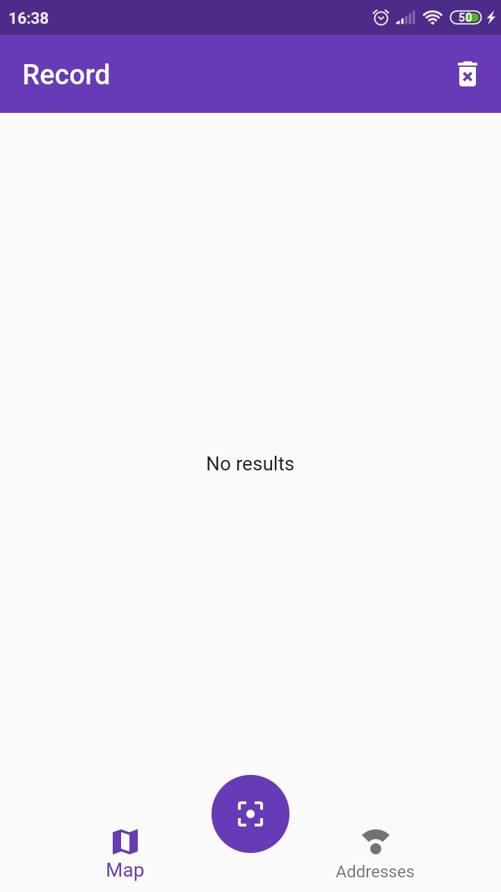
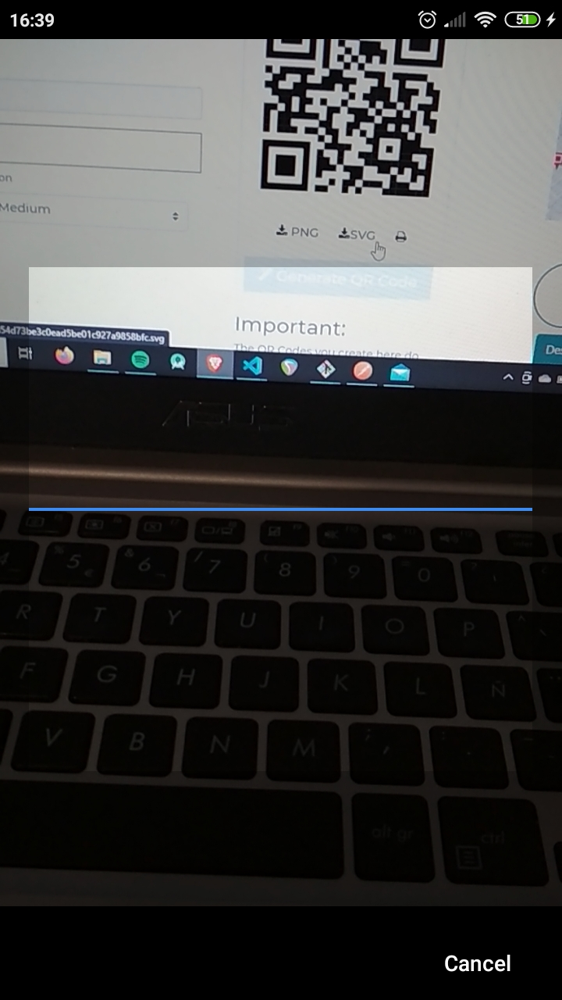
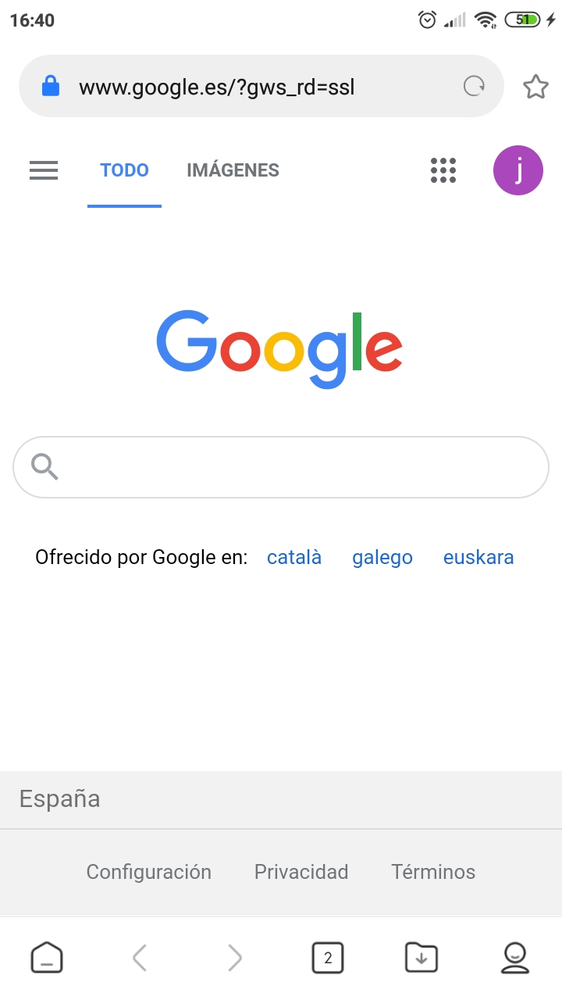
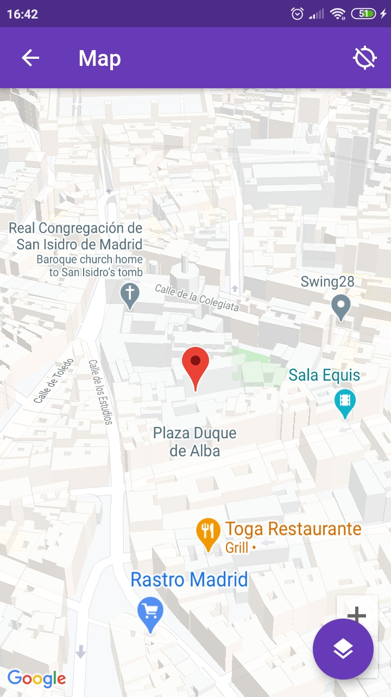
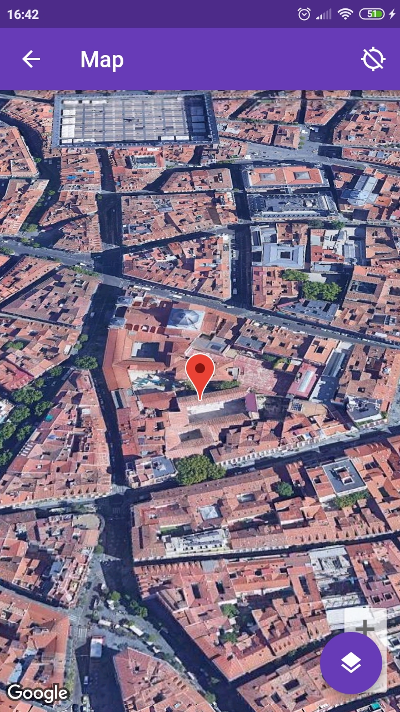
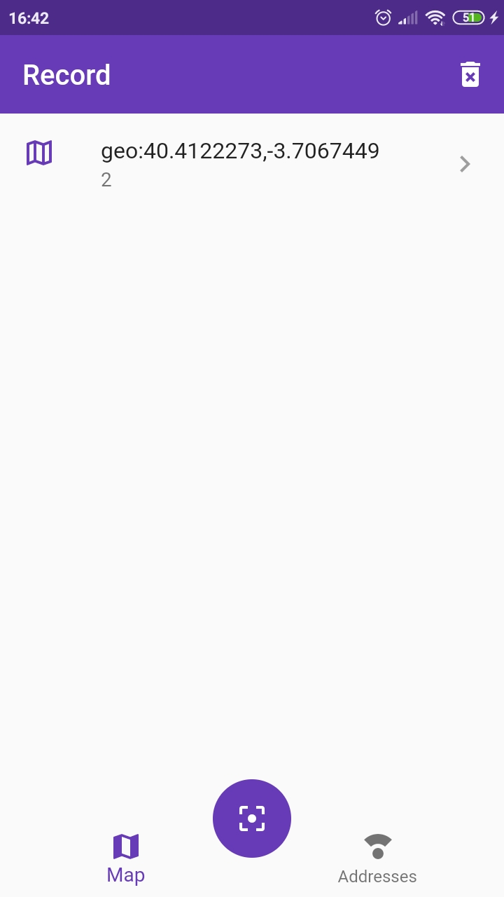
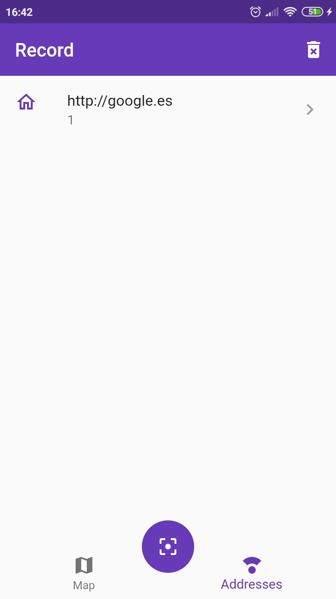

# flutter_qrscan_google_map

A Flutter app that implements a QR reader and a Google Maps plugin.
The app reads the scanned code and show the corresponding data, depending on the content.
If the barcode contains a Web url, it will launch the navigator and will show the Web page. If contains a Geographical coordinates, it will launch the Google Maps app and navigate us to the desired location.

## App Features
The app has the following features:
- Custom app icon
- Provider as State Manager
- Barcode reader
- Sqlite
- Url launcher
- Google Maps

## Screenshots

    
    
    
    
    
    
    
    

